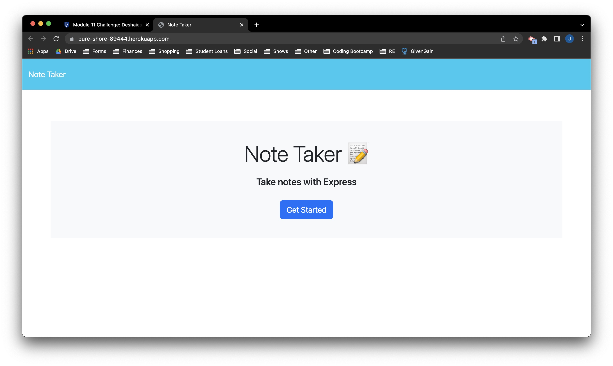
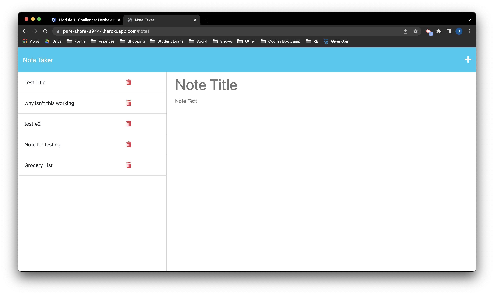

# Note Taker

## Description

The purpose of this application is to be able to write and save notes in order to keep track of ideas and tasks that need to be completed. Since the code for the front end of the application was already in place, the backend had to be developed to route the GET and POST methods to add and retrieve notes from the JSON database file by using Express.js. The GET method was also used to display the main index file for the user and bring them to the notes page when they click "Get Started." Lastly, this application uses a UUID package to randomly generate an ID for each note that is used to retrieve a specific note.

## Table of Contents
- [Installation](#installation)
- [Usage](#usage)
- [License](#license)
- [Questions](#questions)

## Installation

In order to use this application, install the following:
1. npm init -y
2. npm install express@4.16.4
3. npm install uuid@8.3.2

## Usage

Use this application when you want to create and store notes.

## License

This application does not use any licenses currently.

## Questions

Visit my GitHub profile: https://github.com/jdeshaies

For any questions, please reach out to me via email: jd479800@gmail.com